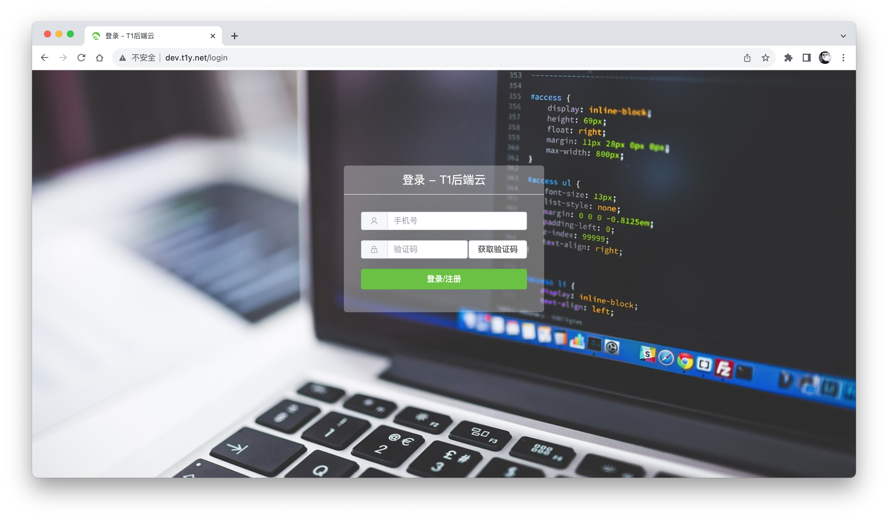
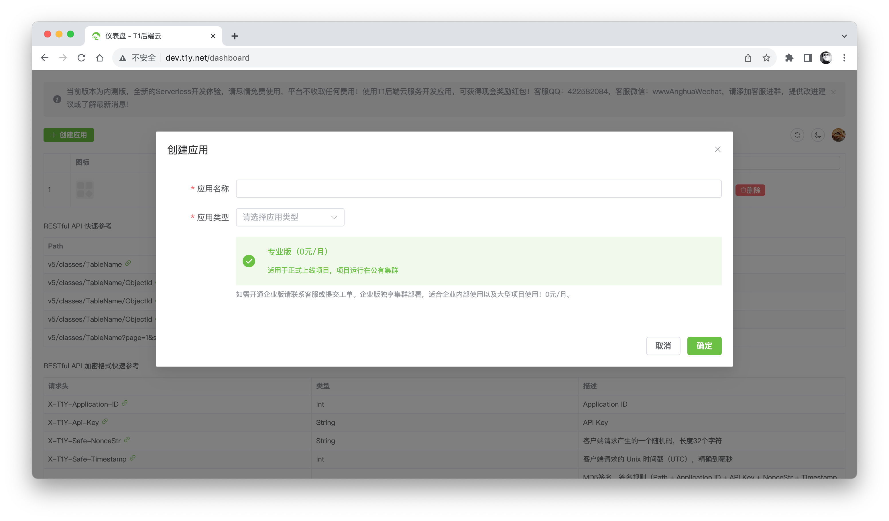
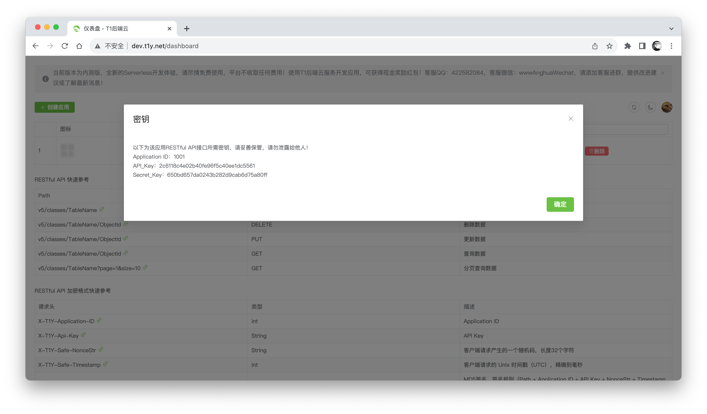
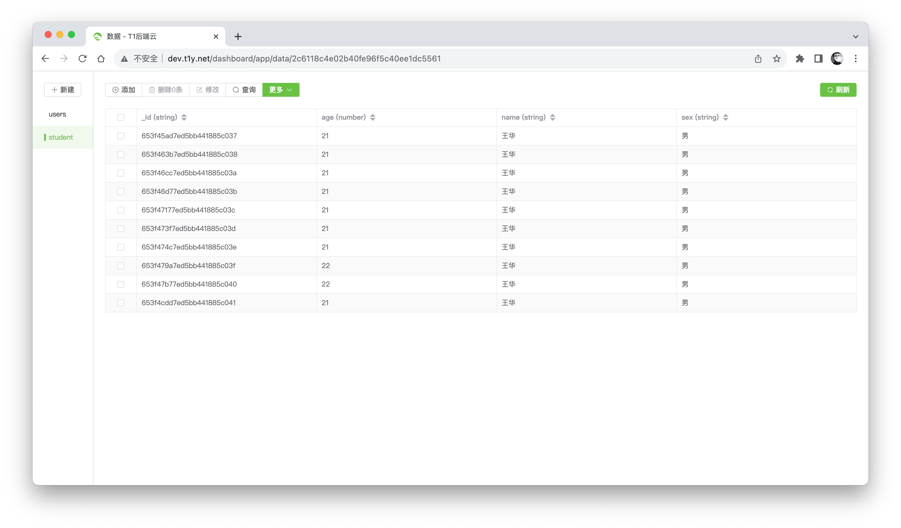
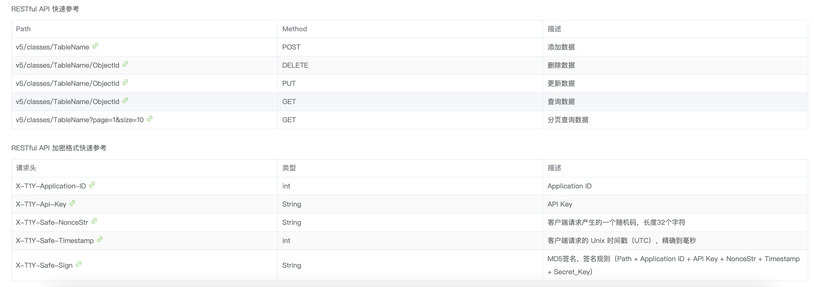

# 开发文档

当前版本：v5（最新）
说明：T1 后端云完全免费，无任何限制，使用需绑定自己已备案的域名，可以联系客服绑定（免费），软件开发期间可以使用以下域名代替：

```bash
http://dev.t1y.net/api
```

获取服务器时间：

```bash
http://dev.t1y.net/api/timestamp
```

Go 语言 SDK：https://github.com/t1ykf/t1y-sdk-go

Vite4+Vue3+TypeScript 封装例子（已全部封装）：https://github.com/t1ykf/t1-vite-vue-typescript-demo

Android 封装例子（已全部封装）：https://github.com/t1ykf/t1y-android-demo

在线调试预览（含各种编程语言示例代码）：http://hub.t1y.net/

更多 SDK 及 功能 持续加入中，期待您的加入……

### 注册 T1 后端云账号

在网址栏输入 dev.t1y.net 或者在百度输入 T1 后端云搜索，打开 T1 后端云 官网后，登录或注册账号，即可进入仪表盘。


### 创建应用

登录账号进入 T1 仪表盘后，点击仪表盘界面左上角“创建应用”，在弹出框输入您应用的名称和类型后确认，您就拥有了一个专业版的应用。


### 获取应用密钥

点击您要查看密钥的应用右边的查看密钥按钮，即可查看密钥。

获取 Application ID 和 API Key 以及 Secret Key，Application ID 以及 API Key 将在后面用于 RESTful API 请求中作为 HTTP 头部的 X-T1Y-Application-ID 和 X-T1Y-Api-Key 的值传到接口。

### 预览管理应用数据

点击开发按钮，即可进入预览与数据管理页面，你可以很轻松的管理各类数据。


### 添加一行数据

添加数据成功后，系统会自动创建 createdAt 以及 updatedAt 字段（若往不存在的表中添加数据，系统会自动创建该表）。

```shell
curl -X POST \
    -H "X-T1Y-Application-ID: Your Application ID" \
    -H "X-T1Y-Api-Key: Your Api Key" \
    -H "X-T1Y-Safe-NonceStr: Client random code" \
    -H "X-T1Y-Safe-Timestamp: Current timestamp" \
    -H "X-T1Y-Safe-Sign: MD5(Path + Application ID + API Key + NonceStr + Timestamp + Secret_Key)" \
    -H "Content-Type: application/json" \
    -d '{"name": "王华", "age": 21, "sex": "男"}' \
    https://自己备案的域名/v5/classes/YourTableName
```

响应示例：

```json
{
  "code": 200,
  "message": "ok",
  "data": {
    "objectId": "65435f093b239fddbc3f646e"
  }
}
```

响应总是包含 `code`、`message`、`data` 三个字段，请求成功为 `200` 状态码，所以请求时判断 HTTP 状态码或者 code 字段即可知道当前操作是否成功。

### 删除一行数据

若 objectId 不存在，系统不会执行任何操作。

```shell
curl -X DELETE \
    -H "X-T1Y-Application-ID: Your Application ID" \
    -H "X-T1Y-Api-Key: Your Api Key" \
    -H "X-T1Y-Safe-NonceStr: Client random code" \
    -H "X-T1Y-Safe-Timestamp: Current timestamp" \
    -H "X-T1Y-Safe-Sign: MD5(Path + Application ID + API Key + NonceStr + Timestamp + Secret_Key)" \
    -H "Content-Type: application/json" \
    https://自己备案的域名/v5/classes/YourTableName/ObjectID
```

响应示例：

```json
{
  "code": 200,
  "message": "ok",
  "data": null
}
```

响应总是包含 `code`、`message`、`data` 三个字段，请求成功为 `200` 状态码，所以请求时判断 HTTP 状态码或者 code 字段即可知道当前操作是否成功。

### 修改一行数据

可以使用`$inc`等操作符。例如使 number 类型的数据增加指定数值，例如年龄增加一岁：`{"$inc": {"age": 1}}`

```shell
curl -X PUT \
    -H "X-T1Y-Application-ID: Your Application ID" \
    -H "X-T1Y-Api-Key: Your Api Key" \
    -H "X-T1Y-Safe-NonceStr: Client random code" \
    -H "X-T1Y-Safe-Timestamp: Current timestamp" \
    -H "X-T1Y-Safe-Sign: MD5(Path + Application ID + API Key + NonceStr + Timestamp + Secret_Key)" \
    -H "Content-Type: application/json" \
    -d '{"$set":{"name": "王华华", "age": 23, "sex": "女"}}' \
    https://自己备案的域名/v5/classes/YourTableName/ObjectID
```

响应示例：

```json
{
  "code": 200,
  "message": "ok",
  "data": null
}
```

响应总是包含 `code`、`message`、`data` 三个字段，请求成功为 `200` 状态码，所以请求时判断 HTTP 状态码或者 code 字段即可知道当前操作是否成功。

### 获取一行数据

```shell
curl -X GET \
    -H "X-T1Y-Application-ID: Your Application ID" \
    -H "X-T1Y-Api-Key: Your Api Key" \
    -H "X-T1Y-Safe-NonceStr: Client random code" \
    -H "X-T1Y-Safe-Timestamp: Current timestamp" \
    -H "X-T1Y-Safe-Sign: MD5(Path + Application ID + API Key + NonceStr + Timestamp + Secret_Key)" \
    -H "Content-Type: application/json" \
    https://自己备案的域名/v5/classes/YourTableName/ObjectID
```

响应示例：

```json
{
  "code": 200,
  "message": "ok",
  "data": {
    "_id": "65435f093b239fddbc3f646e"
    "name": "王华",
    "age": 21,
    "sex": "男",
    "createdAt": "2023-11-04T09:25:24.707+08:00",
    "updatedAt": "2023-11-04T09:25:24.707+08:00"
  }
}
```

响应总是包含 `code`、`message`、`data` 三个字段，请求成功为 `200` 状态码，所以请求时判断 HTTP 状态码或者 code 字段即可知道当前操作是否成功。

### 获取全部数据（分页查询）

分页查询中的 `page` 为页码，`size` 为每页条目数。

```shell
curl -X GET \
    -H "X-T1Y-Application-ID: Your Application ID" \
    -H "X-T1Y-Api-Key: Your Api Key" \
    -H "X-T1Y-Safe-NonceStr: Client random code" \
    -H "X-T1Y-Safe-Timestamp: Current timestamp" \
    -H "X-T1Y-Safe-Sign: MD5(Path + Application ID + API Key + NonceStr + Timestamp + Secret_Key)" \
    -H "Content-Type: application/json" \
    https://自己备案的域名/v5/classes/YourTableName?page=1&size=10
```

响应示例：

```json
{
  "code": 200,
  "message": "ok",
  "data": [
    {
      "_id": "65435f093b239fddbc3f646e"
      "name": "王华",
      "age": 21,
      "sex": "男",
      "createdAt": "2023-11-04T09:25:24.707+08:00",
      "updatedAt": "2023-11-04T09:25:24.707+08:00"
    },
    {
      "_id": "65435f093b239fddbc3f646e"
      "name": "王华华",
      "age": 23,
      "sex": "女",
      "createdAt": "2023-11-04T09:25:24.707+08:00",
      "updatedAt": "2023-11-04T09:25:24.707+08:00"
    }
  ]
}
```

响应总是包含 `code`、`message`、`data` 三个字段，请求成功为 `200` 状态码，所以请求时判断 HTTP 状态码或者 code 字段即可知道当前操作是否成功。

### 批量添加数据

若往不存在的表中添加数据，系统会自动创建该表。

```shell
curl -X POST \
    -H "X-T1Y-Application-ID: Your Application ID" \
    -H "X-T1Y-Api-Key: Your Api Key" \
    -H "X-T1Y-Safe-NonceStr: Client random code" \
    -H "X-T1Y-Safe-Timestamp: Current timestamp" \
    -H "X-T1Y-Safe-Sign: MD5(Path + Application ID + API Key + NonceStr + Timestamp + Secret_Key)" \
    -H "Content-Type: application/json" \
    -d '[{"name": "王华", "age": 21, "sex": "男"}, {"name": "王华华", "age": 23, "sex": "女"}]' \
    https://自己备案的域名/v5/classes/YourTableName/batch
```

响应示例：

```json
{
  "code": 200,
  "message": "ok",
  "data": ["65435f093b239fddbc3f646e", "65435f093b239fddbc3f6474"]
}
```

响应总是包含 `code`、`message`、`data` 三个字段，请求成功为 `200` 状态码，所以请求时判断 HTTP 状态码或者 code 字段即可知道当前操作是否成功。

### 批量删除数据

```shell
curl -X DELETE \
    -H "X-T1Y-Application-ID: Your Application ID" \
    -H "X-T1Y-Api-Key: Your Api Key" \
    -H "X-T1Y-Safe-NonceStr: Client random code" \
    -H "X-T1Y-Safe-Timestamp: Current timestamp" \
    -H "X-T1Y-Safe-Sign: MD5(Path + Application ID + API Key + NonceStr + Timestamp + Secret_Key)" \
    -H "Content-Type: application/json" \
    -d '["65435f093b239fddbc3f646e", "65435f093b239fddbc3f6474"]' \
    https://自己备案的域名/v5/classes/YourTableName/batch
```

响应示例：

```json
{
  "code": 200,
  "message": "ok",
  "data": {
    "deletedCount": 2
  }
}
```

响应总是包含 `code`、`message`、`data` 三个字段，请求成功为 `200` 状态码，所以请求时判断 HTTP 状态码或者 code 字段即可知道当前操作是否成功。

### 批量修改数据

```shell
curl -X PUT \
    -H "X-T1Y-Application-ID: Your Application ID" \
    -H "X-T1Y-Api-Key: Your Api Key" \
    -H "X-T1Y-Safe-NonceStr: Client random code" \
    -H "X-T1Y-Safe-Timestamp: Current timestamp" \
    -H "X-T1Y-Safe-Sign: MD5(Path + Application ID + API Key + NonceStr + Timestamp + Secret_Key)" \
    -H "Content-Type: application/json" \
    -d '[{"id": "65435f093b239fddbc3f646e", "body": {"$set":{"name": "王华华", "age": 23, "sex": "女"}}}, {"id": "65435f093b239fddbc3f6474", "body": {"$set":{"name": "林黛玉", "age": 33, "sex": "女"}}}]' \
    https://自己备案的域名/v5/classes/YourTableName/batch
```

响应示例：

```json
{
  "code": 200,
  "message": "ok",
  "data": {
    "updatedCount": 2
  }
}
```

### 高级查询（分页、排序、比较）

高级查询可以使用条件操作符，更好的过滤结果。

- (or) 或 - $or
- (>) 大于 - $gt
- (<) 小于 - $lt
- (>=) 大于等于 - $gte
- (<= ) 小于等于 - $lte
- 不等于 - $ne
- 存在 - $exists -> true
- 不存在 - $exists -> false
- 包含 - $in
- 不包含 - $nin
- 模糊查询 $regex -> 正则表达式

模糊查询稍复杂一点，比如查询首字母包含 a 的：`{"name": "/a/"}` 等同于 `like '%a%'`

首字母是 pa 的：`{"name": "/^pa/"}`

也可以使用 `$regex` 正则匹配

例如查询第一页，每页 10 条数据，以年龄进行降序排序（-1 为降序，1 为升序），并且年龄大于 20 岁的：

```shell
curl -X POST \
    -H "X-T1Y-Application-ID: Your Application ID" \
    -H "X-T1Y-Api-Key: Your Api Key" \
    -H "X-T1Y-Safe-NonceStr: Client random code" \
    -H "X-T1Y-Safe-Timestamp: Current timestamp" \
    -H "X-T1Y-Safe-Sign: MD5(Path + Application ID + API Key + NonceStr + Timestamp + Secret_Key)" \
    -H "Content-Type: application/json" \
    -d '{"page": 1, "size": 10, "sort": {"age": -1}, "body": {"age": {"$gt": 20}}}' \
    https://自己备案的域名/v5/classes/YourTableName/query
```

响应示例：

```json
{
  "code": 200,
  "message": "ok",
  "data": [
    {
      "_id": "65435f093b239fddbc3f646e"
      "name": "王华华",
      "age": 23,
      "sex": "女",
      "createdAt": "2023-11-04T09:25:24.707+08:00",
      "updatedAt": "2023-11-04T09:25:24.707+08:00"
    },
    {
      "_id": "65435f093b239fddbc3f646e"
      "name": "王华",
      "age": 21,
      "sex": "男",
      "createdAt": "2023-11-04T09:25:24.707+08:00",
      "updatedAt": "2023-11-04T09:25:24.707+08:00"
    }
  ]
}
```

响应总是包含 `code`、`message`、`data` 三个字段，请求成功为 `200` 状态码，所以请求时判断 HTTP 状态码或者 code 字段即可知道当前操作是否成功。

### 聚合查询（分组、聚合、运算）

聚合查询可以很方便的统计数据情况。

- $sum 计算总和

```json
[
  {
    "$group": {
      "_id": "$name",
      "num_tutorial": { "$sum": "$age" }
    }
  }
]
```

- $avg 计算平均值

```json
[
  {
    "$group": {
      "_id": "$name",
      "num_tutorial": { "$avg": "$age" }
    }
  }
]
```

- $min 获取最小值

```json
[
  {
    "$group": {
      "_id": "$name",
      "num_tutorial": { "$min": "$age" }
    }
  }
]
```

- $max 获取最大值

```json
[
  {
    "$group": {
      "_id": "$name",
      "num_tutorial": { "$max": "$age" }
    }
  }
]
```

- $push 将值加入一个数组中，不会判断是否有重复的值

```json
[
  {
    "$group": {
      "_id": "$name",
      "num_tutorial": { "$push": "$array" }
    }
  }
]
```

- $addToSet 将值加入一个数组中，会判断是否有重复的值，若相同的值在数组中已经存在了，则不加入

```json
[
  {
    "$group": {
      "_id": "$name",
      "num_tutorial": { "$addToSet": "$array" }
    }
  }
]
```

- $first 根据数据的排序获取第一条数据

```json
[
  {
    "$group": {
      "_id": "$name",
      "num_tutorial": { "$first": "$array" }
    }
  }
]
```

- $last 根据数据的排序获取最后一条数据

```json
[
  {
    "$group": {
      "_id": "$name",
      "num_tutorial": { "$last": "$array" }
    }
  }
]
```

例如统计名字相同的学生数量：

```shell
curl -X POST \
    -H "X-T1Y-Application-ID: Your Application ID" \
    -H "X-T1Y-Api-Key: Your Api Key" \
    -H "X-T1Y-Safe-NonceStr: Client random code" \
    -H "X-T1Y-Safe-Timestamp: Current timestamp" \
    -H "X-T1Y-Safe-Sign: MD5(Path + Application ID + API Key + NonceStr + Timestamp + Secret_Key)" \
    -H "Content-Type: application/json" \
    -d '[{"$group" : {"_id" : "$name", "sum" : {"$sum" : 1}}}]' \
    https://自己备案的域名/v5/classes/YourTableName/aggregate
```

响应示例：

```json
{
  "code": 200,
  "data": {
    "data": [
      {
        "_id": "王华华",
        "sum": 1
      },
      {
        "_id": "王华",
        "sum": 6
      }
    ]
  },
  "message": "ok"
}
```

响应总是包含 `code`、`message`、`data` 三个字段，请求成功为 `200` 状态码，所以请求时判断 HTTP 状态码或者 code 字段即可知道当前操作是否成功。

### 查询所有表

```shell
curl -X GET \
    -H "X-T1Y-Application-ID: Your Application ID" \
    -H "X-T1Y-Api-Key: Your Api Key" \
    -H "X-T1Y-Safe-NonceStr: Client random code" \
    -H "X-T1Y-Safe-Timestamp: Current timestamp" \
    -H "X-T1Y-Safe-Sign: MD5(Path + Application ID + API Key + NonceStr + Timestamp + Secret_Key)" \
    -H "Content-Type: application/json" \
    https://自己备案的域名/v5/schemas
```

响应示例：

```json
{
  "code": 200,
  "data": {
    "tables": ["users", "student"]
  },
  "message": "ok"
}
```

响应总是包含 `code`、`message`、`data` 三个字段，请求成功为 `200` 状态码，所以请求时判断 HTTP 状态码或者 code 字段即可知道当前操作是否成功。

### 创建表

使用该接口可以创建一个指定表，但是使用创建数据接口，往不存在的表中创建数据时，系统会自动创建该表，效果是一样的。

```shell
curl -X POST \
    -H "X-T1Y-Application-ID: Your Application ID" \
    -H "X-T1Y-Api-Key: Your Api Key" \
    -H "X-T1Y-Safe-NonceStr: Client random code" \
    -H "X-T1Y-Safe-Timestamp: Current timestamp" \
    -H "X-T1Y-Safe-Sign: MD5(Path + Application ID + API Key + NonceStr + Timestamp + Secret_Key)" \
    -H "Content-Type: application/json" \
    https://自己备案的域名/v5/schemas/TableName
```

响应示例：

```json
{
  "code": 200,
  "data": null,
  "message": "ok"
}
```

响应总是包含 `code`、`message`、`data` 三个字段，请求成功为 `200` 状态码，所以请求时判断 HTTP 状态码或者 code 字段即可知道当前操作是否成功。

### 清空表

使用该接口会清空指定表中的所有数据，⚠️ 危险操作，谨慎使用！

```shell
curl -X PUT \
    -H "X-T1Y-Application-ID: Your Application ID" \
    -H "X-T1Y-Api-Key: Your Api Key" \
    -H "X-T1Y-Safe-NonceStr: Client random code" \
    -H "X-T1Y-Safe-Timestamp: Current timestamp" \
    -H "X-T1Y-Safe-Sign: MD5(Path + Application ID + API Key + NonceStr + Timestamp + Secret_Key)" \
    -H "Content-Type: application/json" \
    https://自己备案的域名/v5/schemas/TableName
```

响应示例：

```json
{
  "code": 200,
  "data": null,
  "message": "ok"
}
```

响应总是包含 `code`、`message`、`data` 三个字段，请求成功为 `200` 状态码，所以请求时判断 HTTP 状态码或者 code 字段即可知道当前操作是否成功。

### 删除表

使用该接口会删除指定表及表中的所有数据，⚠️ 危险操作，谨慎使用！

```shell
curl -X DELETE \
    -H "X-T1Y-Application-ID: Your Application ID" \
    -H "X-T1Y-Api-Key: Your Api Key" \
    -H "X-T1Y-Safe-NonceStr: Client random code" \
    -H "X-T1Y-Safe-Timestamp: Current timestamp" \
    -H "X-T1Y-Safe-Sign: MD5(Path + Application ID + API Key + NonceStr + Timestamp + Secret_Key)" \
    -H "Content-Type: application/json" \
    https://自己备案的域名/v5/schemas/TableName
```

响应示例：

```json
{
  "code": 200,
  "data": null,
  "message": "ok"
}
```

响应总是包含 `code`、`message`、`data` 三个字段，请求成功为 `200` 状态码，所以请求时判断 HTTP 状态码或者 code 字段即可知道当前操作是否成功。

### 获取短信验证码

使用该接口用于获取短信验证码，验证码数据会存储到 `sys_codes` 表中。

```shell
curl -X GET \
    -H "X-T1Y-Application-ID: Your Application ID" \
    -H "X-T1Y-Api-Key: Your Api Key" \
    -H "X-T1Y-Safe-NonceStr: Client random code" \
    -H "X-T1Y-Safe-Timestamp: Current timestamp" \
    -H "X-T1Y-Safe-Sign: MD5(Path + Application ID + API Key + NonceStr + Timestamp + Secret_Key)" \
    -H "Content-Type: application/json" \
    https://自己备案的域名/v5/sys/code?phone=18888888888
```

响应示例：

```json
{
  "code": 200,
  "message": "ok",
  "data": {
    "objectId": "65435f093b239fddbc3f646e"
  }
}
```

响应总是包含 `code`、`message`、`data` 三个字段，请求成功为 `200` 状态码，所以请求时判断 HTTP 状态码或者 code 字段即可知道当前操作是否成功。

### 发送邮件

使用该接口用于发送邮件，支持 HTML，邮件数据会存储到 `sys_emails` 表中，有已经编写好的模板，请访问<a href="./EMAIL.md">EMAIL.md</a>。

```shell
curl -X POST \
    -H "X-T1Y-Application-ID: Your Application ID" \
    -H "X-T1Y-Api-Key: Your Api Key" \
    -H "X-T1Y-Safe-NonceStr: Client random code" \
    -H "X-T1Y-Safe-Timestamp: Current timestamp" \
    -H "X-T1Y-Safe-Sign: MD5(Path + Application ID + API Key + NonceStr + Timestamp + Secret_Key)" \
    -H "Content-Type: application/json" \
    -d '{"to": "收件人邮箱", "subject": "标题", "body": "<p>这是一封测试邮件。</p>"}' \
    https://自己备案的域名/v5/sys/email
```

响应示例：

```json
{
  "code": 200,
  "message": "ok",
  "data": {
    "objectId": "65435f093b239fddbc3f646e"
  }
}
```

响应总是包含 `code`、`message`、`data` 三个字段，请求成功为 `200` 状态码，所以请求时判断 HTTP 状态码或者 code 字段即可知道当前操作是否成功。

### X-T1Y-Safe-Sign 加密格式说明

X-T1Y-Safe-Sign 用于生成签名，确保数据安全。你应当使用 URL 中的路径（注意 GET 参数不需要参与运算）+您的 Application ID+您的 API Key+NonceStr（这是客户端随机生成的 32 位字符串）+Timestamp（当前时间戳，精确到秒即可）+您的 SecretKey 进行 MD5 取值，就得到了 X-T1Y-Safe-Sign 的值。

**举例：查询全部数据**
查询 student 表中的第 1 页的 10 条数据

```bash
http://自己备案的域名/v5/classes/student?page=1&size=10
```

这时 X-T1Y-Safe-Sign 的值就应当为以下内容的 MD5 运算结果：

```js
MD5(
  "/v5/classes/student" +
    Application_ID +
    API_Key +
    NonceStr +
    Timestamp +
    Secret_Key
);
```

### 快速参考表



### 联系我们

- 网站：dev.t1y.net
- 邮箱：wwwanghua@outlook.com
- QQ：422584084
- 微信：wwwAnghuaWechat
- QQ 交流群 1：671186603
- QQ 交流群 2：292846194
- Github 组织：https://github.com/t1ykf
